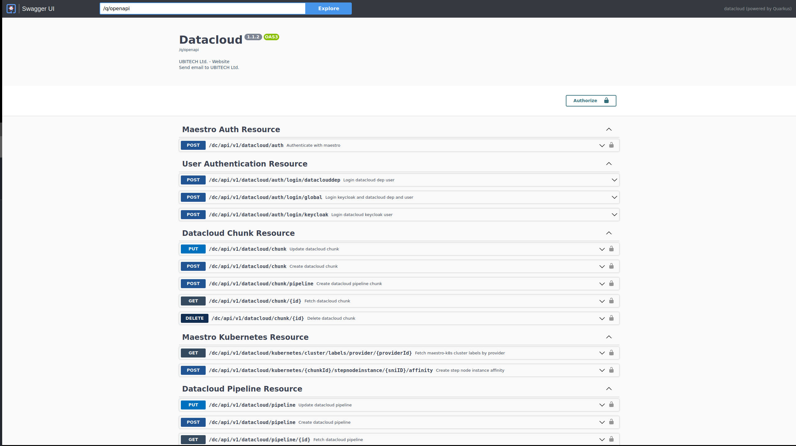

<p align="center"></p>&nbsp;

[](https://github.com/DataCloud-project/DEP-PIPE-translator/issues)
[](https://opensource.org/licenses/Apache-2.0)

# **DEP-PIPE Translator**

The aim of this project is to develop an autonomous Datacloud Microservice that provides the essential tools and operations for handling Steps, Chunks, Pipelines, Pipeline deployments, Providers, Provider Types, User Authentication and Registration, Maestro Authentication, K8s Cluster Labels.

### Functionalities

The microservice exposes a set of REST API endpoints responsible for handling:

1. Steps (Create, Fetch by ID, Update, Delete)

2. Chunks (Create, Fetch by ID, Update, Delete)

3. Pipelines (Create, Fetch by ID, Update, Delete)

4. Pipeline deployment requests (deployment, undeployment, cancellation)

5. Providers (Create, Fetch by ID, Update, Delete, List, List for Deployment)

6. Provider Types (Fetch by ID, list)

7. User Authentication(Keycloak Login, DEP-PIPE Login, Global Login)

8. User Registration(Keycloak registration, DEP-PIPE registration, Global Registration)

9. Maestro Authentication(Generate access token)

10. K8s Cluster labels(Fetch by Provider ID, Create step node instance affinity)

The microservice communicates with MAESTRO to execute the requests.


[//]: # (Translator of the descriptor provided by ADA-PIPE in order to be deployed through DEP-PIPE)

### API Documentation

The exposed rest services are documented using the **OpenAPI v3.0.3** specification and **Swagger UI**. The project ships with a Documentation UI page under http://PROJECT_IP:PROJECT_PORT/q/swagger-ui, where PROJECT_IP and PROJECT_PORT correspond to the parameters used to run the microservice (e.g. http://localhost:9500/q/swagger-ui)



<br/>


## **Project Setup and Usage**

This project is built using **[Quarkus](https://quarkus.io/) Java Framework v2.16.9**. In order to run the application in development mode you will need **Java v11**, and **Maven version 3.8.6** or higher. Optionally, to produce native executable version you will need **GraalVM v22.2.0 or higher**.

You can set project parameters in **src/main/resources/application.yaml** file:
- *quarkus.http.port* sets the port in which the microservice
- *quarkus.rest-client.maestro-rest-api.url* is the url in which the MAESTRO backend is running
- *quarkus.rest-cliend.defpipe-rest-api.url* is the url in which the DEF-PIPE backend is running
- *quarkus.oidc.credentials.secret* the client secret of the backend client in keycloak
- *quarkus.oidc-client.credentials.secret* is the client secret to interact with def-pipe
- *quarkus.oidc-client.grant-options.password.password* the password of the user which uses the client
- *mongodb.connection-string* is the url of the mongodb used in the microservice
- *mongodb.database* is the url of the mongodb used in the microservice

### Running the application in dev mode

You can start the application in dev mode using:
```shell script
./mvnw compile quarkus:dev
```

> **_NOTE:_**  Quarkus now ships with a Dev UI, which is available in dev mode only at http://localhost:9500/q/dev/.

### Packaging and running the application

The application can be packaged using:
```shell script
./mvnw package
```
It produces the `quarkus-run.jar` file in the `target/quarkus-app/` directory.
Be aware that it’s not an _über-jar_ as the dependencies are copied into the `target/quarkus-app/lib/` directory.

The application is now runnable using `java -jar target/quarkus-app/quarkus-run.jar`.

If you want to build an _über-jar_, execute the following command:
```shell script
./mvnw package -Dquarkus.package.type=uber-jar
```

The application, packaged as an _über-jar_, is now runnable using `java -jar target/*-runner.jar`.

### Creating a native executable

You can create a native executable using:
```shell script
./mvnw package -Pnative
```

Or, if you don't have GraalVM installed, you can run the native executable build in a container using:
```shell script
./mvnw package -Pnative -Dquarkus.native.container-build=true
```

You can then execute your native executable with: `./target/datacloud-{version}-runner`

To learn more about building native executable see https://quarkus.io/guides/maven-tooling.

### Containerized version

There are two docker-compose files: 

- *docker-compose.yml* which will use the dev profile properties of the project
- *docker-compose.prod.yml* which can be used along with .env file (as one in .env.example) to set specifically the parametres of the project.
